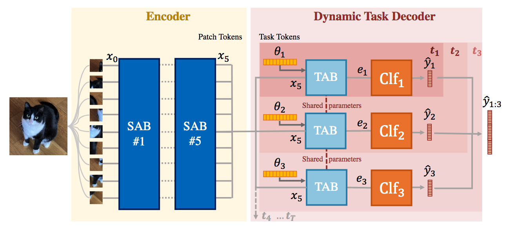

<div align="center">

# DyTox: Transformers for Continual Learning with DYnamic TOken eXpansion

[](https://arxiv.org/abs/2111.11326)


</div>




Welcome to DyTox, the first transformer designed explicitly for Continual Learning!


# Installation

You first need to have a working python installation with version >= 3.6.

Then create a conda env, and install the libraries in the `requirements.txt`: it
includes pytorch and torchvision for the building blocks of our model. It also
includes continuum for data loader made for continual learning, and `timm`.

Note that this code is heavily based on the great codebase of [DeiT](https://github.com/facebookresearch/deit).

# Launching an experiment

CIFAR100 dataset will be auto-downloaded, however you must download yourself
ImageNet.

Each command needs three options files:
- which dataset you want to run on and in which settings (i.e. how many steps)
- Which class ordering, by default it'll be 0->C-1, but we used the class ordering
  proposed by DER (and which all baselines also follow)
- Which model version you want (DyTox, DyTox+, and DyTox++ (see supplementary
  about that last one))

To launch DyTox on CIFAR100 in the 50 steps setting on the GPUs #0 and #1:

```bash
bash train.sh 0,1 \
    --options options/data/cifar100_2-2.yaml options/data/cifar100_order1.yaml options/model/cifar_dytox.yaml \
    --name dytox \
    --data-path MY_PATH_TO_DATASET \
    --output-basedir PATH_TO_SAVE_CHECKPOINTS
```

Folders will be auto-created with the results at
`logs/cifar/2-2/{DATE}/{DATE}/{DATE}-dytox`.

Likewise, to launch DyTox+ and DyTox++, simply change the options. It's also the
same for datasets. Note that we provided 3 different class orders (from DER's
implem) for CIFAR100, and we average the results in our paper.

When you have a doubt about the options to use, just check what was defined in the
yaml option files in the folder `./options`.

# Resuming an experiment

Some exp can be slow and you may need to resume it, like for ImageNet1000.

First locate the checkpoints folder (by default at `./checkpoints/` if you didn't
specify any `output-basedir`) where your experiment first ran. Then run the
following command (I'm taking ImageNet1000 as an example but you could have
taken any models and datasets):

```bash
bash train.sh 0,1 \
    --options options/data/imagenet1000_100-100.yaml options/data/imagenet1000_order1.yaml options/model/imagenet_dytox.yaml \
    --name dytox \
    --data-path MY_PATH_TO_DATASET \
    --resume MY_PATH_TO_CKPT_FOLDER_OF_EXP \
    --start-task TASK_ID_STARTING_FROM_0_OF_WHEN_THE_EXP_HAD_STOPPED
```

# Citation

If you compare to this model or use this code for any means, please cite us! Thanks :)

```
@inproceedings{douillard2021dytox,
  title     = {DyTox: Transformers for Continual Learning with DYnamic TOken eXpansion},
  author    = {Douillard, Arthur and Ram\'e, Alexandre and Couairon, Guillaume and Cord, Matthieu},
  booktitle = {Proceedings of the IEEE Conference on Computer Vision and Pattern Recognition (CVPR)},
  year      = {2022}
}
```
